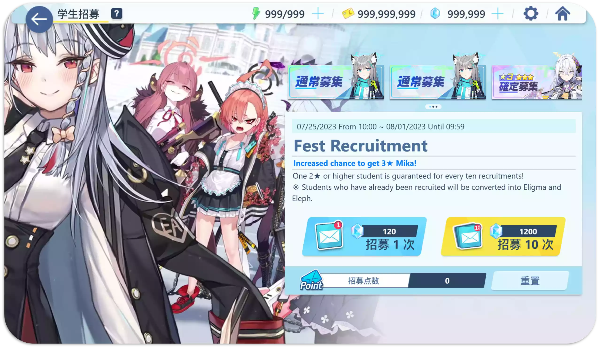
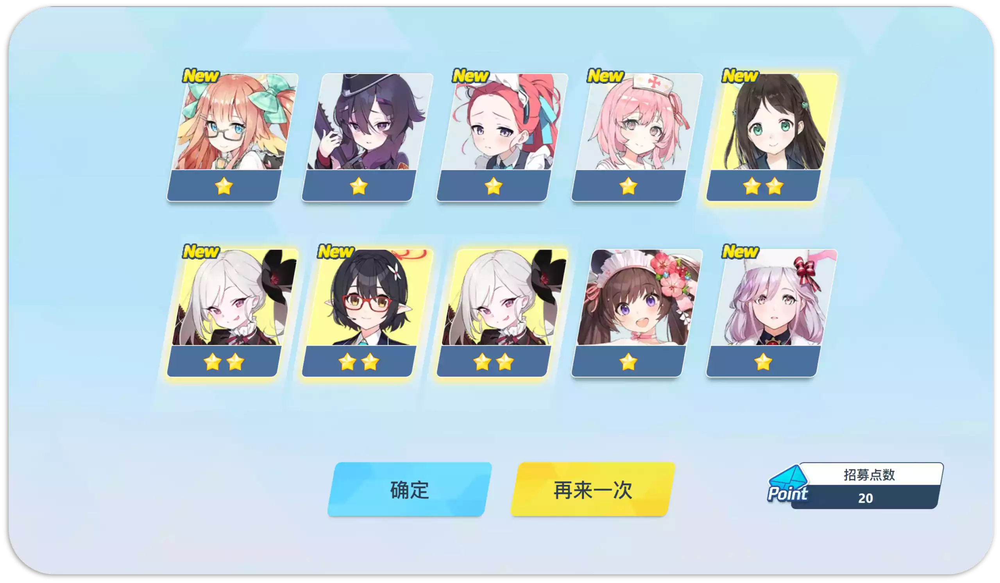

<h1 align="center">碧蓝档案抽卡模拟器</h1>

    
    
    

  <strong>在线吃井模拟器</strong> 
  无聊了就来抽抽卡吧

## 预览

[小抽一井!](https://u1805.github.io/blue-archive-gacha-simulator)

## 使用方法

**随便点**

<small>（抽卡结果仅供娱乐，切勿当真）</small>

## 🌟

## 贡献

Issue 和 PR 大欢迎！如果你遇到任何问题或者有好想法，请开一个 issue。另外也欢迎提交 pull request 来解决问题或者实现新功能。

## 感谢

项目灵感来自:

- [Genshin Impact Wish Simulator](https://github.com/uzair-ashraf/genshin-impact-wish-simulator/)

角色数据来自:

- [lonqie/SchaleDB](https://github.com/lonqie/SchaleDB)
- [Bluearchive.Fandom](https://bluearchive.fandom.com)

## License
[MIT License](./LICENSE)

## Copyrights

本应用中的资源均来自第三方网站获取，部分视频是游戏内录屏。